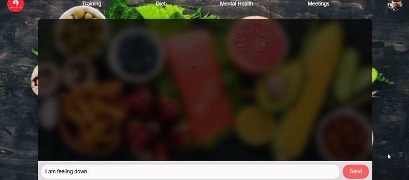
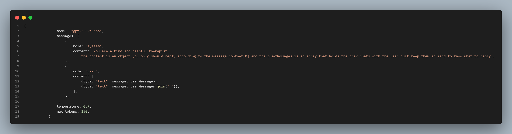
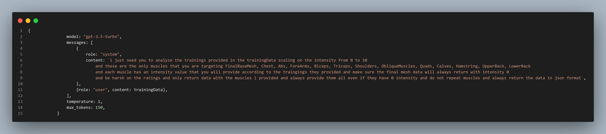
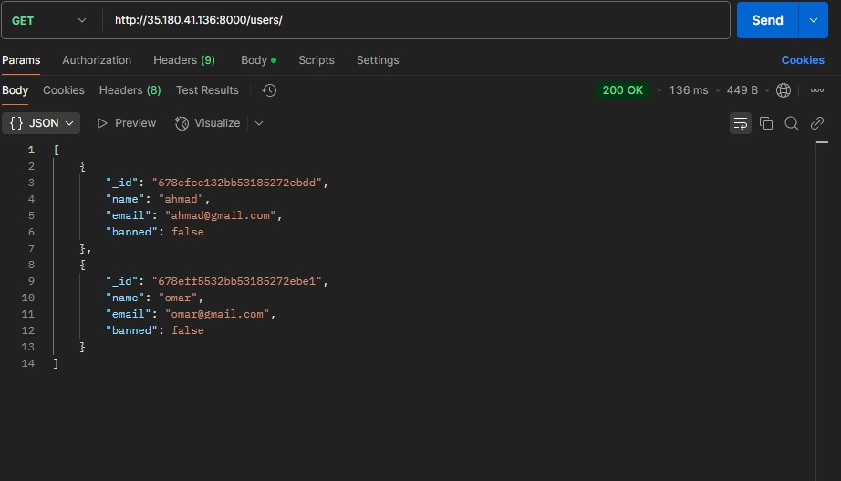

<br><br>

<!-- project philosophy -->


Balance Beam is a website and mobile app designed to guide users toward a healthier lifestyle by personalizing their physical and mental well-being journey. It offers tailored food recommendations, curated training programs, and interactive fitness tracking, with 3D models to visualize muscle activity. The app also features an AI-powered therapist for emotional support and the ability to book online consultations with nutritionists, fitness coaches, or therapists, providing personalized care. Balance Beam aims to harmonize physical and mental wellness, making it accessible and engaging for all.
### User Stories
#### User
- As a user, I want to input my dietary preferences and health data, so that I can check whether specific ingredients are healthy for me based on the information I provided.
- As a fitness enthusiast, I want to view a 3D model of my body after a workout, so that I can see which muscles I targeted and how intensely they were engaged.

- As a user seeking professional advice, I want to schedule an online meeting with a nutritionist, coach, or therapist, so that I can receive personalized guidance to improve my health and well-being.

#### Nutritionist
- As a nutritionist, I want to analyze a user's dietary habits and provide personalized meal plans, so that I can guide them towards healthier food choices that complement their fitness goals.
- As a nutritionist, I want to track my clients' progress and adjust their meal plans based on their feedback and results, so that I can ensure they continue to make progress toward their goals.
- As a nutritionist, I want to schedule and conduct online consultations with users, so that I can provide real-time advice and answer their questions related to their diet and nutrition.

#### Coach
- As a coach, I want to create workouts for each muscle for my clients, so that I can help them achieve their fitness goals.
- As a coach, I want to communicate directly with my clients through video calls, so that I can offer guidance, motivation, and real-time feedback.
- As a coach, I want the users to be able to see how much they targeted each muscle through a 3D model which will give them some guidance outside the online sessions

#### Therapist
- As a therapist, I want to provide emotional support through an AI-powered system, so that users can receive guidance and therapy whenever they need it, even outside of scheduled sessions.
- As a therapist, I want to schedule and conduct video sessions with users, so that I can provide personalized therapy sessions and help them address their mental health concerns.
- As a therapist, I want to monitor the mental health status of my clients through feedback and session notes, so that I can offer tailored support and advice during our consultations.

#### Admin 
- As an admin, I want to manage user access levels (e.g., blocking or suspending users), so that I can ensure the security of the platform and address any behavior violations.
- As an admin, I want to be able to create accounts for therapists, nutritionists, and coaches and delete them whenever one is terminated.
- As an admin, I want to see how many users do we many users do we currently have in our website
<br><br>
<!-- Tech stack -->


###  BalanceBeam is built using the following technologies:

- This project uses the [React framework](https://react.dev/) framework. React is a powerful library for building user interfaces on the web, and it uses [Redux](https://redux-toolkit.js.org/) for state management.

- This project uses the [Three.js library](https://threejs.org/), a powerful JavaScript framework for creating 3D graphics on the web. Three.js simplifies the process of rendering 3D scenes, models, and animations by providing an extensive API and tools that run directly in the browser. With Three.js, you can build immersive experiences like interactive 3D applications, virtual reality environments, and much more, all without requiring specialized software.

- For persistent storage (database), the app uses the [MongoDB](https://www.mongodb.com/) package which allows the app to create a custom storage schema and save it to a local database.

- This project uses [Node.js](https://nodejs.org/en) and [Express.js](https://expressjs.com/) for backend development. Node.js is a powerful runtime environment that allows us to execute JavaScript on the server side, providing scalability and high performance. Express.js is a lightweight and flexible web application framework built on Node.js, enabling us to create robust APIs and handle server-side logic efficiently. Together, they form the foundation for building a fast and scalable backend.

- [JWT](https://jwt.io/introduction) is utilized for authentication and session management.

- This project uses [socket.io](https://socket.io/) and [webrtc](https://webrtc.org/) to establish a connection for the online meeting and chatting


<br><br>
<!-- UI UX -->


> We designed BalanceBeam using wireframes and mockups, iterating on the design until we reached the ideal layout for easy navigation and a seamless user experience.

- Project Figma design [figma](https://www.figma.com/design/2MF5oxtEMRFRCJ1vw46BMl/Untitled?node-id=4-182&p=f&t=wkdn3Jb2ReNnnWxl-0)


### Mockups
| Hero section  | Lobby Screen | |
| ---| ---| ---|
|  |  
 
<br><br>

<!-- Database Design -->


###  Schemas Used For Developing This Project :

| food Schema | meeting Schema | program Schema |
| ---| ---| ---|
|  |    |  |
| user Schema |
|  | 
<br><br>


<!-- Implementation -->


### User Screens (Web)

|Mental Health Screen|3Dmodel feature |   |
| ---| ---| ---|
| |  | 
|  Online Meeting  |  Chats in Meeting  |
 |   |   
| Booking Meeting  |Profile Screen| 
|   | |
  

### Admin Screens (Web)
|  Admin screen | Creating Expert | |
| ---| ---| ---|
| |   | 


<br><br>


<!-- Prompt Engineering -->


###  Prompts Used in this Project:

- This project uses the gpt-3.5-turbo in 2 places the first for is in showing it as a therapist Ai that will help you and guide you emotionally and offer some advices to overcome your problem

- The second way is by showcasing it as a coach that will tell you the intensity of your workout on each muscle and its analysis will be visualized on a 3D model


<br><br>

<!-- AWS Deployment -->


###  AWS Deployment Steps and Postman documentation:

- This project's backend was deployed using an AWS instance which was by first connecting to the server then cloning the [backend](https://github.com/ahmad-abouamoun/Server) part of the project into the the server and then cd Server after that install nvm so that you could install Nodejs latest version and make sure to download the mongoDB into the server

|  Create User API | Get Users API | |
| ---| ---| ---|
| |   | 
|  Create Food API | Create Program API | |
| |   | 

<br><br>

### CI/CD PipeLine Creation:
- After the creating the unit tests in the backend and deploying the code on AWS the next step was creating the CI/CD so that the tests that i created will be tested whenever i push to the repo and then if all the tests were successful the code will be automatically deployed onto the AWS instance

<!-- Unit Testing -->


###  Hranessing the Power of Unit Testing:

- This project uses the unit testing on the backend using [jest](https://jestjs.io/) which help us detect any issues in the backend early on and fix them as soon as possible


<br><br>


<!-- How to run -->


> To set up BalanceBeam locally, follow these steps:

### Prerequisites

1.  Ensure that Node.js and npm are installed on your system. If not, you can download them from Node.js.
    Install the latest npm version: 
  ```sh
* npm
  npm install npm@latest -g

  ```
2.  Ensure that you login inside Atlas and create a new project and after naming the project, create a new cluster then setup your connection inside the backend.

3.  Ensure Git is installed for cloning the repository. Install it from [Git's official site](https://git-scm.com/) if not already installed.

### Installation

_Below is an example of how you can instruct your audience on installing and setting up your app. This template doesn't rely on any external dependencies or services._

### BalanceBeam-backend


1. Clone the repo
   git clone [github](https://github.com/ahmad-abouamoun/BalanceBeam)

2. At your terminal change the directory to your backend
   ```sh
   cd Server
   ```
3. Install NPM packages
   ```sh
   npm install
   ```
4. Configure Environment Variables Create a .env file in the root directory and provide the necessary values as follows:
   ``` sh
   secretKey="Generate a JWT secret"
   OPENAI_API_KEY=API_KEY
   ```
5. After completing the Setup go to your terminal and type this inside the terminal hence be sure you are inside the Server folder:

   ``` sh
   nodemon src/index.js
   ```

   if the message appeared like this inside your terminal then the backend connection is correct:

   ```   sh
   Connected to db
   ```
### BalanceBeam-frontend

1. Clone the repo git clone [github](https://github.com/ahmad-abouamoun/BalanceBeam) if you have already cloned skip this step.
2. At your terminal change the directory to your frontend
   ```sh
   cd Client
   ```
3. Install NPM packages

   ```sh
   npm install
   ```
5. After completing the Setup go to your terminal and type this inside the terminal hence be sure you are inside the Client folder:

   ```sh
   npm start
   ```
   if the message appeared like this inside your terminal then the fronend connection is correct:
   ```sh
   > client@0.1.0 start
   > react-scripts start

   Compiled successfully!

   You can now view client in the browser.

   Local:            http://localhost:3000
   On Your Network:  http://192.168.56.1:3000

   Note that the development build is not optimized.
   To create a production build, use npm run build.

   webpack compiled successfully

   Note that the development build is not optimized.
   To create a production build, use npm run build.

   Compiled successfully!

   You can now view client in the browser.


   Note that the development build is not optimized.
   To create a production build, use npm run build.

   webpack compiled successfully
   ```
Now, you should be able to run BalanceBeam locally and explore its features.